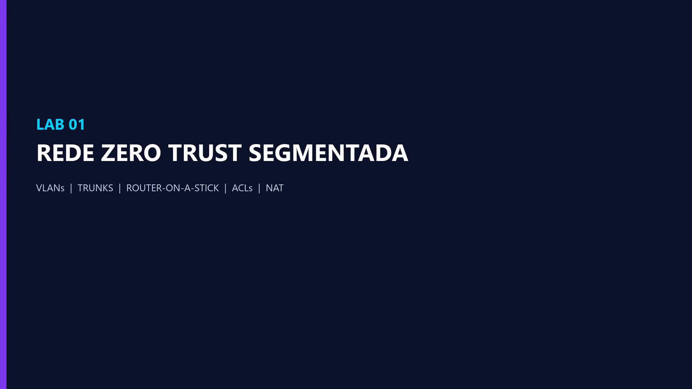
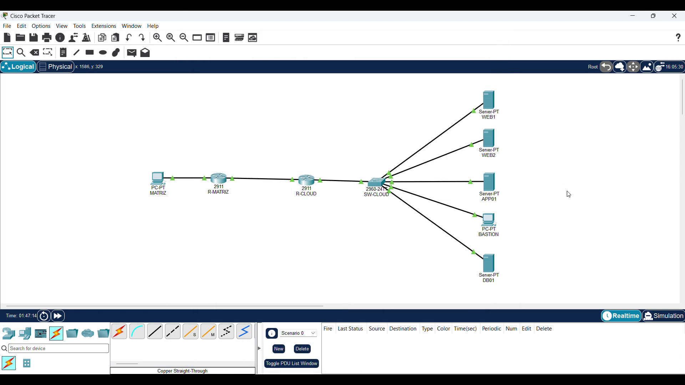
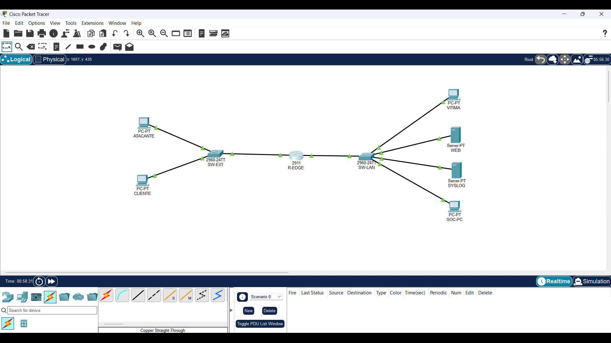

# Packet Tracer Cybersecurity Portfolio

Hands-on network security labs designed, built, tested, recorded, and documented by **[mari-2215](https://github.com/mari-2215)**.

This portfolio demonstrates practical networking and defensive-security skills through Cisco Packet Tracer. Every completed project is directly accessible below: documentation, the `.pkt` topology, and the edited validation video are linked from this page. No folder hunting is required.

> Packet Tracer is used to demonstrate networking and security fundamentals. AWS and Azure mappings are conceptual and do not claim identical behavior between Cisco IOS and cloud-native controls.

## All completed projects — direct access

| Lab | Security focus | Status | Documentation | Packet Tracer | Video |
|---|---|---|---|---|---|
| **01 — Segmented Enterprise Network** | VLANs, ACLs, SSH, DHCP, NAT and unused-port hardening | Documented; selected controls validated | [Read](labs/lab-01-zero-trust-enterprise/README.md) | [Download `.pkt`](labs/lab-01-zero-trust-enterprise/packet-tracer/Lab_01_Segmented_Enterprise_Network.pkt) | [Watch](labs/lab-01-zero-trust-enterprise/video/Lab_01_portfolio_FINAL.mp4) |
| **02 — Hybrid Cloud Security** | DMZ, application and database tiers, NAT, ACLs and bastion administration | Validated with documented corrections | [Read](labs/lab-02-cloud-security/README.md) | [Download `.pkt`](labs/lab-02-cloud-security/packet-tracer/Lab_02_Hybrid_Cloud_Security.pkt) | [Watch](labs/lab-02-cloud-security/video/Lab_02_Hybrid_Cloud_Security_Final.mp4) |
| **03 — SOC Incident Response** | Baseline, detection, ACL containment and service-preservation testing | Completed and validated | [Read](labs/lab-03-incident-response/README.md) | [Download `.pkt`](labs/lab-03-incident-response/packet-tracer/Lab_03_SOC_Incident_Response.pkt) | [Watch](labs/lab-03-incident-response/video/Lab_03_SOC_Incident_Response_Final.mp4) |
| **04 — Healthcare Segmentation** | Clinical, administrative, IoMT, guest and server isolation | Completed and recorded | [Read](labs/lab-04-healthcare-segmentation/README.md) | [Download `.pkt`](labs/lab-04-healthcare-segmentation/packet-tracer/Lab_04_Healthcare_Network_Segmentation.pkt) | [Watch](labs/lab-04-healthcare-segmentation/video/Lab_04_Healthcare_Network_Segmentation_Final.mp4) |
| **05 — Resilient Branch Routing** | OSPF adjacency, alternate paths, failure and convergence | Completed and recorded | [Read](labs/lab-05-ospf-resilience/README.md) | [Download `.pkt`](labs/lab-05-ospf-resilience/packet-tracer/Lab_05_Resilient_Branch_Routing.pkt) | [Watch](labs/lab-05-ospf-resilience/video/Lab_05_Resilient_Branch_Routing_Final.mp4) |
| **06 — Secure Management and IAM** | Management-plane isolation, SSH, AAA/RADIUS and local fallback | Validated with a documented simulator limitation | [Read](labs/lab-06-secure-administration/README.md) | [Download `.pkt`](labs/lab-06-secure-administration/packet-tracer/Lab_06_Secure_Management_IAM.pkt) | [Watch](labs/lab-06-secure-administration/video/Lab_06_Secure_Management_IAM_Final.mp4) |

## Project 01 — Segmented Enterprise Network

A small enterprise is divided into user, finance, server, IT, guest, management, and black-hole VLANs. The lab demonstrates router-on-a-stick, explicit trunks, DHCP, ACL policy, restricted SSH administration, and troubleshooting based on evidence rather than link color alone.

**Open directly:** [Documentation](labs/lab-01-zero-trust-enterprise/README.md) · [Packet Tracer project](labs/lab-01-zero-trust-enterprise/packet-tracer/Lab_01_Segmented_Enterprise_Network.pkt) · [Validation video](labs/lab-01-zero-trust-enterprise/video/Lab_01_portfolio_FINAL.mp4) · [Validation matrix](labs/lab-01-zero-trust-enterprise/evidence/validation-matrix.md)

## Project 02 — Hybrid Cloud Security Architecture

A headquarters network connects to a simulated cloud environment with separate DMZ, application, database, and management tiers. Static web publication, least-privilege database policy, routing, NAT, and bastion-style SSH administration are documented with explicit limitations.

**Open directly:** [Documentation](labs/lab-02-cloud-security/README.md) · [Packet Tracer project](labs/lab-02-cloud-security/packet-tracer/Lab_02_Hybrid_Cloud_Security.pkt) · [Validation video](labs/lab-02-cloud-security/video/Lab_02_Hybrid_Cloud_Security_Final.mp4) · [Evidence](labs/lab-02-cloud-security/evidence/)

## Project 03 — SOC Incident Detection and Containment

This lab follows a compact incident-response cycle: establish a legitimate HTTP baseline, identify unauthorized traffic through edge ACL counters, contain the test source, and verify that the legitimate service remains available.

**Open directly:** [Documentation](labs/lab-03-incident-response/README.md) · [Packet Tracer project](labs/lab-03-incident-response/packet-tracer/Lab_03_SOC_Incident_Response.pkt) · [Validation video](labs/lab-03-incident-response/video/Lab_03_SOC_Incident_Response_Final.mp4) · [Evidence](labs/lab-03-incident-response/evidence/)

## Project 04 — Healthcare Network Segmentation

A healthcare scenario separates clinical workstations, IoMT equipment, administrative users, guests, servers, and IT management. The design focuses on least privilege, patient-data exposure reduction, and continuity-oriented network reasoning.

**Open directly:** [Documentation](labs/lab-04-healthcare-segmentation/README.md) · [Packet Tracer project](labs/lab-04-healthcare-segmentation/packet-tracer/Lab_04_Healthcare_Network_Segmentation.pkt) · [Validation video](labs/lab-04-healthcare-segmentation/video/Lab_04_Healthcare_Network_Segmentation_Final.mp4)

## Project 05 — Resilient Branch Routing

A headquarters and three branch routers use OSPF to exchange routes and provide an alternate path. The project records neighbor formation, route troubleshooting, link failure, convergence, and recovery concepts.

**Open directly:** [Documentation](labs/lab-05-ospf-resilience/README.md) · [Packet Tracer project](labs/lab-05-ospf-resilience/packet-tracer/Lab_05_Resilient_Branch_Routing.pkt) · [Validation video](labs/lab-05-ospf-resilience/video/Lab_05_Resilient_Branch_Routing_Final.mp4)

## Project 06 — Secure Management and IAM

An isolated management plane restricts administrative access to an approved network. The lab demonstrates SSH-only VTY access, a source ACL, AAA/RADIUS design, RADIUS reachability, Telnet rejection, and a validated local break-glass fallback. The RADIUS authentication limitation is disclosed instead of being presented as a false success.

**Open directly:** [Documentation](labs/lab-06-secure-administration/README.md) · [Packet Tracer project](labs/lab-06-secure-administration/packet-tracer/Lab_06_Secure_Management_IAM.pkt) · [Validation video](labs/lab-06-secure-administration/video/Lab_06_Secure_Management_IAM_Final.mp4)

## Next project

### Packets from Hell

A themed network experiment involving packet journeys, TTL expiration, routing behavior, loops, OSPF, and STP — with the promised pentagram-shaped topology.

[Open the project plan](labs/packets-from-hell/README.md)

## Skills demonstrated

| Area | Portfolio evidence |
|---|---|
| Network segmentation | VLANs, subnets, 802.1Q trunks and router-on-a-stick |
| Traffic control | Standard and extended ACLs, positive and negative testing |
| Secure administration | SSH-only access, management ACLs, AAA design and fallback access |
| Resilience | OSPF neighbors, alternate paths, failure and convergence |
| Incident response | Baseline, detection, containment and post-change validation |
| Cloud-security reasoning | Conceptual mappings to AWS VPC/IAM and Azure VNet/Entra controls |
| Evidence handling | Edited demonstrations, screenshots, command output and documented limitations |

## Repository organization

Each project keeps its supporting material grouped internally so files remain maintainable:

- `README.md` — scenario, controls, tests, results and limitations;
- `packet-tracer/` — downloadable `.pkt` project;
- `video/` — edited demonstration;
- `evidence/` — screenshots and validation notes when available;
- `configs/` — reference configurations when available.

All user-facing artifacts are linked directly from the project table at the top of this page.

## Portfolio principles

- **Evidence over claims:** a control is marked as validated only when supporting output exists.
- **Negative testing matters:** expected failures are part of security validation.
- **Troubleshooting is part of the work:** mistakes are converted into documented engineering lessons.
- **Least privilege:** administrative and inter-zone access is limited to required paths.
- **No production secrets:** all credentials, names, and addresses are lab-only examples.

## Responsible-use notice

These are defensive educational environments. They are not production architectures, penetration-testing authorizations, or substitutes for vendor-specific design review. Only test systems that you own or are explicitly authorized to assess.

## Author

**mari-2215**  
[github.com/mari-2215](https://github.com/mari-2215)
