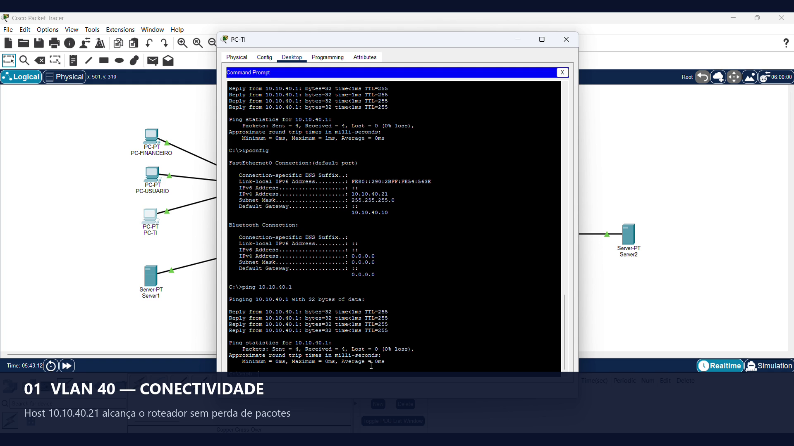
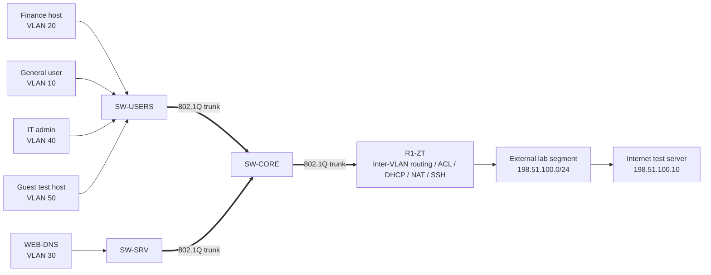
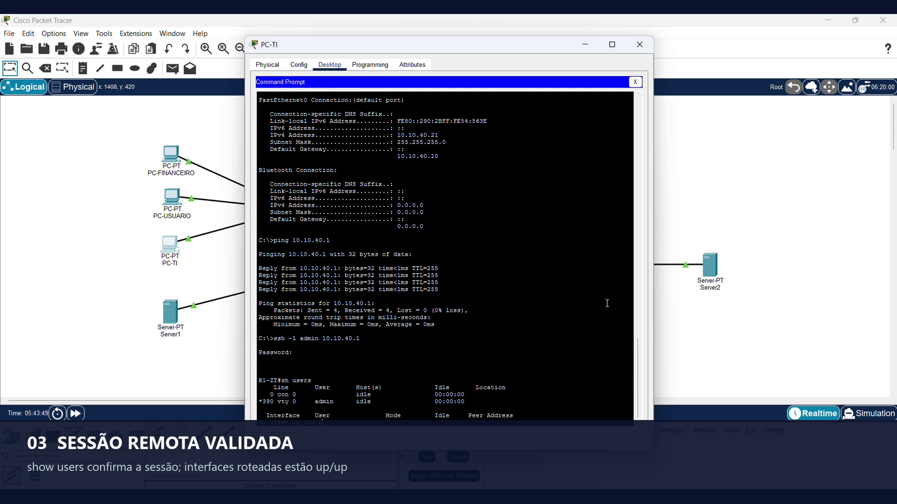
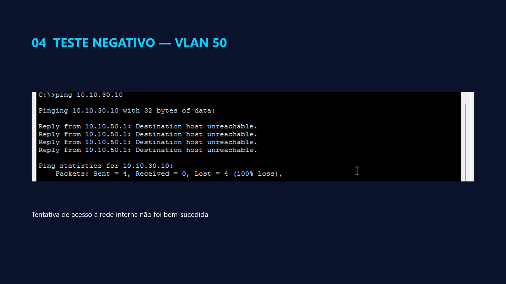

# Lab 01 — Segmented Enterprise Network

**Author:** [mari-2215](https://github.com/mari-2215)  
**Platform:** Cisco Packet Tracer  
**Status:** Core build documented; selected controls validated  
**Theme:** Segmentation, least privilege, secure administration, and evidence-driven troubleshooting

[Watch or download the edited demonstration](video/Lab_01_portfolio_FINAL.mp4)

## Executive summary

This lab models a small enterprise network with separate trust zones for general users, finance, servers, IT administrators, guests, device management, and unused switch ports. A Cisco router provides inter-VLAN routing through 802.1Q subinterfaces. Layer 2 switches enforce port membership and carry selected VLANs over trunks.

The security objective is to reduce unnecessary lateral movement while preserving required services. Extended ACLs define allowed DNS and web flows before denying access to internal address space. SSH administration is restricted to the IT subnet. Unused access ports are assigned to a black-hole VLAN and administratively disabled.

The final video demonstrates successful reachability from the IT VLAN to the router, an authenticated SSH session, active routed interfaces, and an unsuccessful internal-access attempt originating from the VLAN 50 test host. The limitations section explicitly separates those observations from features that were configured but not conclusively validated on camera.

## Business scenario

A small company has users, finance staff, internal services, IT administrators, and visitors on the same physical infrastructure. A flat network would expose sensitive systems to unnecessary peer-to-peer access. The company therefore needs:

- logical separation between business roles;
- controlled access to internal services;
- a guest zone with restricted internal reachability;
- a dedicated management network;
- SSH-only administrative access from IT;
- basic internet egress through NAT;
- disabled and isolated unused switch ports.

## Security objectives

| Objective | Control |
|---|---|
| Separate user populations | VLANs and access-port assignments |
| Carry multiple zones between infrastructure devices | Explicit 802.1Q trunks and allowed-VLAN lists |
| Route only at the policy-enforcement point | Router-on-a-stick subinterfaces |
| Restrict lateral movement | Inbound extended ACLs on source VLAN subinterfaces |
| Limit device administration | SSH, local account, VTY restriction and management ACL |
| Reduce unused-port exposure | VLAN 999 plus administrative shutdown |
| Provide client addressing | Per-zone DHCP pools |
| Represent internet egress | NAT overload configuration |

## High-level architecture

## Logical segmentation

| VLAN | Name | IPv4 network | Gateway | Purpose |
|---:|---|---|---|---|
| 10 | USERS | `10.10.10.0/24` | `10.10.10.1` | General endpoints |
| 20 | FINANCE | `10.10.20.0/24` | `10.10.20.1` | Finance endpoints |
| 30 | SERVERS | `10.10.30.0/24` | `10.10.30.1` | Internal services |
| 40 | IT | `10.10.40.0/24` | `10.10.40.1` | Administrative workstation |
| 50 | GUEST | `10.10.50.0/24` | `10.10.50.1` | Restricted visitor/test zone |
| 99 | MGMT | `10.10.99.0/24` | `10.10.99.1` | Infrastructure management |
| 999 | BLACKHOLE | No routed address | None | Native/unused-port isolation |

### Fixed addresses

| Device | Address | Default gateway |
|---|---|---|
| WEB-DNS | `10.10.30.10/24` | `10.10.30.1` |
| Internet test server | `198.51.100.10/24` | `198.51.100.1` |
| SW-CORE management SVI | `10.10.99.2/24` | `10.10.99.1` |
| SW-USERS management SVI | `10.10.99.3/24` | `10.10.99.1` |
| SW-SRV management SVI | `10.10.99.4/24` | `10.10.99.1` |

## Recommended physical port map

This is the reproducible target layout. The interactive recording included cabling corrections, so the final Packet Tracer workspace may use different endpoint labels or access-port placement.

| Device A | Port A | Device B | Port B | Mode |
|---|---|---|---|---|
| R1-ZT | G0/0 | SW-CORE | G0/1 | 802.1Q trunk |
| R1-ZT | G0/1 | External segment/server | F0 | Routed access |
| SW-CORE | F0/23 | SW-USERS | F0/24 | 802.1Q trunk |
| SW-CORE | F0/24 | SW-SRV | F0/24 | 802.1Q trunk |
| SW-USERS | F0/1 | General user | F0 | Access VLAN 10 |
| SW-USERS | F0/2 | Finance host | F0 | Access VLAN 20 |
| SW-USERS | F0/3 | IT host | F0 | Access VLAN 40 |
| SW-USERS | F0/4 | Guest host | F0 | Access VLAN 50 |
| SW-SRV | F0/1 | WEB-DNS | F0 | Access VLAN 30 |

## Threat model

### Assets

- finance endpoint and business data;
- internal web and DNS services;
- router and switch management planes;
- network segmentation policy;
- external connectivity.

### Representative threats

| Threat | Example path | Mitigation represented in the lab |
|---|---|---|
| Guest lateral movement | VLAN 50 to internal RFC1918-style lab networks | Inbound `GUEST-IN` ACL |
| General-user lateral movement | VLAN 10 to finance or management | Inbound `USERS-IN` ACL |
| Unauthorized administration | Non-IT endpoint to router VTY | Standard ACL 40 plus SSH-only VTY |
| VLAN hopping/misuse of idle ports | Unused access port | VLAN 999 and shutdown |
| Accidental overexposure | Broad trunk or ACL rule | Explicit allowed-VLAN list and ordered ACL entries |

## Control implementation

### Layer 2 segmentation

Access ports assign endpoints to a single VLAN. Infrastructure links operate as trunks and use an explicit allowed-VLAN list. The target design uses VLAN 999 as the native VLAN and as an isolation destination for unused ports.

### Inter-VLAN routing

R1-ZT uses one subinterface per routed VLAN. Each subinterface has `encapsulation dot1Q`, the VLAN gateway address, and the appropriate NAT/policy role. Reference commands are stored in [`configs/r1-zt-reference.txt`](configs/r1-zt-reference.txt).

### ACL policy

The intended guest policy permits DHCP and the required DNS path, then denies access to internal `10.10.0.0/16` lab space before permitting other destinations. The rule order is deliberate: Cisco IOS ACLs are evaluated sequentially and end with an implicit deny.

### Secure administration

The router is configured for SSH and local authentication. VTY access is filtered so that only the IT subnet (`10.10.40.0/24`) may initiate a remote administrative session.

### Unused-port hardening

Unused access ports are moved to VLAN 999 and shut down. This is a lab representation of reducing exposed switch access, not a replacement for production features such as 802.1X, NAC, DHCP snooping, dynamic ARP inspection, and centralized identity.

## Validation matrix

| ID | Test | Expected | Recorded result | Evidence |
|---|---|---|---|---|
| VAL-01 | IT host (`10.10.40.21`) pings R1-ZT (`10.10.40.1`) | Success | Four replies, no packet loss | [Screenshot](../../docs/assets/lab-01-vlan40.png) |
| VAL-02 | IT host opens SSH session to `10.10.40.1` | Authenticated session | `admin` appears on VTY in `show users` | [Screenshot](../../docs/assets/lab-01-ssh.png) |
| VAL-03 | Display routed interfaces during SSH session | Required subinterfaces up/up | VLAN gateways shown up/up | Video and SSH screenshot |
| VAL-04 | VLAN 50 host attempts to reach internal server `10.10.30.10` | Unsuccessful | Destination unreachable / 100% loss | [Screenshot](../../docs/assets/lab-01-negative-vlan50.png) |
| VAL-05 | VLAN 50 host reaches external test server through NAT | Success | Inconclusive recording; omitted from final edit | Not claimed as validated |
| VAL-06 | ACL counters increase on the intended deny entry | Counter increment | Not captured | Not claimed as validated |

## Evidence

### VLAN 40 reachability

### Authenticated SSH session

### Negative internal-access test

### Edited demonstration

[Open `Lab_01_portfolio_FINAL.mp4`](video/Lab_01_portfolio_FINAL.mp4)

The video is silent by design. On-screen titles identify the construction stages and validation evidence.

## Troubleshooting record

The build was intentionally documented as performed, including corrections. The most important lessons were:

1. **A green link is not proof of correct logical placement.** Several failures came from cables connected to switch ports different from those configured for the intended VLAN.
2. **Layer 1 must be checked first.** The external/cloud segment was initially unavailable because a device was powered off.
3. **Subinterfaces can appear operational while missing an IPv4 address.** VLAN 40, 50, and 99 subinterfaces initially showed `up/up` but `unassigned`; assigning their gateway addresses restored Layer 3 behavior.
4. **DHCP troubleshooting should be separated from VLAN troubleshooting.** A temporary static address helped determine whether the failure was DHCP-specific or an interrupted Layer 2 path.
5. **ACL ordering matters.** DHCP, DNS, management reachability, internal deny rules, and the final permitted egress path must be considered in sequence.
6. **Descriptions do not guarantee physical truth.** A switchport description can say `PC-GUEST` while the actual cable is connected elsewhere. `show interfaces status`, `show interfaces trunk`, CDP, and visible port labels are stronger evidence.

## Known limitations and evidence boundaries

- The video proves same-subnet reachability from `10.10.40.21` to `10.10.40.1` and a successful SSH session.
- During recording, the IT host displayed `10.10.40.10` as its default gateway even though the router gateway is `10.10.40.1`. Same-subnet ping and SSH remain valid, but routed traffic from that host should be re-tested after correcting the default gateway.
- The VLAN 50 recording proves that the attempt to `10.10.30.10` was unsuccessful. The final clip does not include ACL hit counters, so it does not independently prove which individual ACL entry produced the result.
- NAT was configured, but a clean external test and `show ip nat translations` evidence were not captured. NAT is therefore described as configured, not validated.
- Packet Tracer simplifies device behavior and does not reproduce all timing, control-plane, logging, stateful inspection, identity, or cloud-provider semantics.
- No production-grade zero-trust claim is made. The project demonstrates segmentation and least-privilege building blocks.

## Cloud-security relevance

The lab builds transferable reasoning rather than one-to-one product equivalence:

| Packet Tracer concept | AWS conceptual analogue | Azure conceptual analogue |
|---|---|---|
| VLAN / IP zone | VPC subnet | VNet subnet |
| IOS extended ACL | Network ACL and, depending on scope, security-group policy | Network Security Group or Azure Firewall policy |
| Router default/NAT path | Route table, Internet Gateway, NAT Gateway | Route table, public egress/NAT Gateway |
| Management VLAN and restricted SSH | Private management subnet, scoped security group, Systems Manager or bastion pattern | Management subnet, NSG, Azure Bastion |
| IOS operational output | VPC Flow Logs and CloudWatch evidence | NSG flow logs/virtual network flow logs and Azure Monitor evidence |

See the detailed [cloud control mapping](../../docs/cloud-control-mapping.md).

## How to reproduce

1. Place the devices and cable them according to the recommended port map.
2. Create VLANs on all switches before assigning ports.
3. Configure access ports and verify them with `show vlan brief`.
4. Configure trunks on both ends and verify allowed/active/forwarding VLANs with `show interfaces trunk`.
5. Configure router subinterfaces and confirm every required gateway with `show ip interface brief`.
6. Configure fixed server addressing and DHCP pools.
7. Configure and apply ACLs in the correct direction.
8. Configure SSH and restrict VTY access.
9. Validate one control at a time using the matrix in [`evidence/validation-matrix.md`](evidence/validation-matrix.md).
10. Save device configurations and the Packet Tracer project.

## Reference configurations

- [`R1-ZT`](configs/r1-zt-reference.txt)
- [`SW-CORE`](configs/sw-core-reference.txt)
- [`SW-USERS`](configs/sw-users-reference.txt)
- [`SW-SRV`](configs/sw-srv-reference.txt)

These are reference target configurations reconstructed from the documented design and troubleshooting corrections. They are not exported production configurations.

## Primary references

- [Cisco — Configure IP Access Lists](https://www.cisco.com/c/en/us/support/docs/security/ios-firewall/23602-confaccesslists.html)
- [Cisco — Configure SSH on Routers](https://www.cisco.com/c/en/us/support/docs/security-vpn/secure-shell-ssh/4145-ssh.html)
- [Cisco — Configuring Virtual Interfaces](https://www.cisco.com/c/en/us/td/docs/routers/ios-xe/ip-routing/b-ip-routing/m_ir-cfg-vir-if-xe.html)
- [AWS — Control traffic using security groups](https://docs.aws.amazon.com/vpc/latest/userguide/vpc-security-groups.html)
- [AWS — Control subnet traffic with network ACLs](https://docs.aws.amazon.com/vpc/latest/userguide/vpc-network-acls.html)
- [Microsoft — Azure network security groups overview](https://learn.microsoft.com/en-us/azure/virtual-network/network-security-groups-overview)
- [Microsoft — Azure virtual networks and virtual machines](https://learn.microsoft.com/en-us/azure/virtual-network/network-overview)

## Author

Built and documented by **[mari-2215](https://github.com/mari-2215)**.

