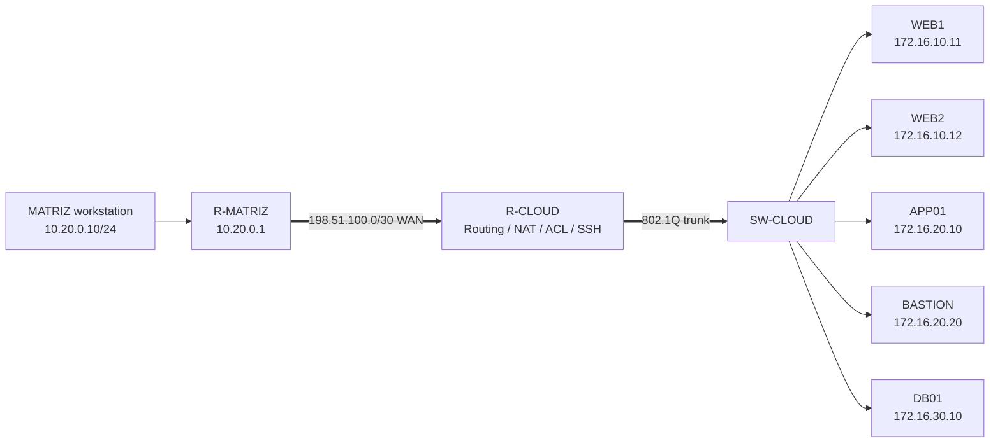
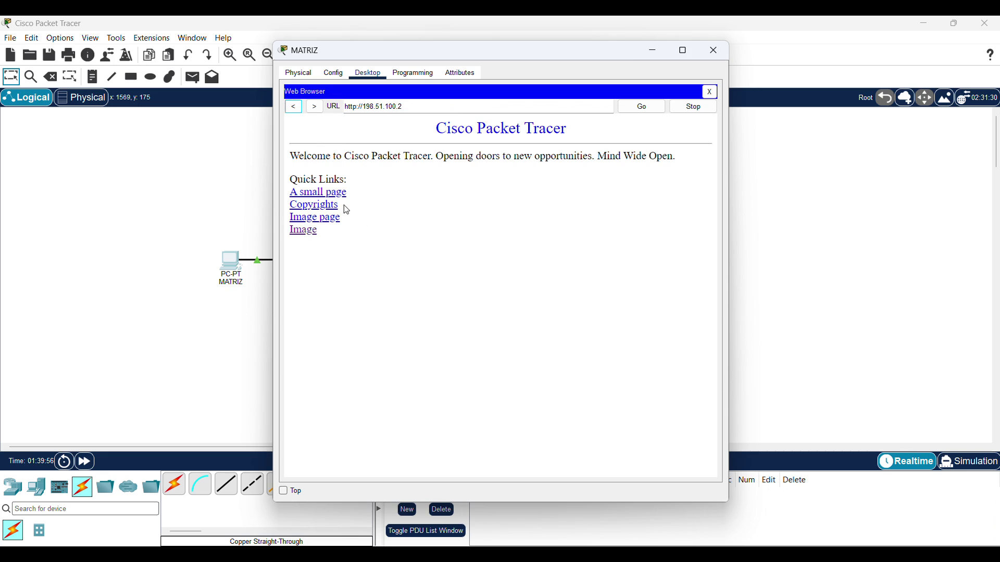
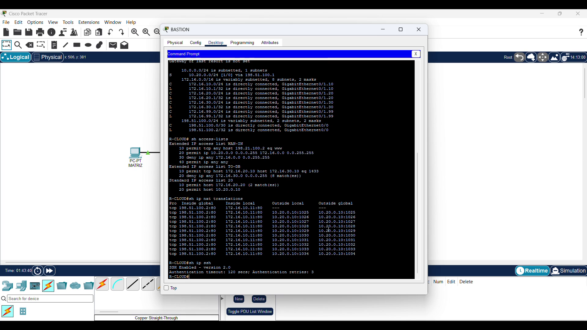
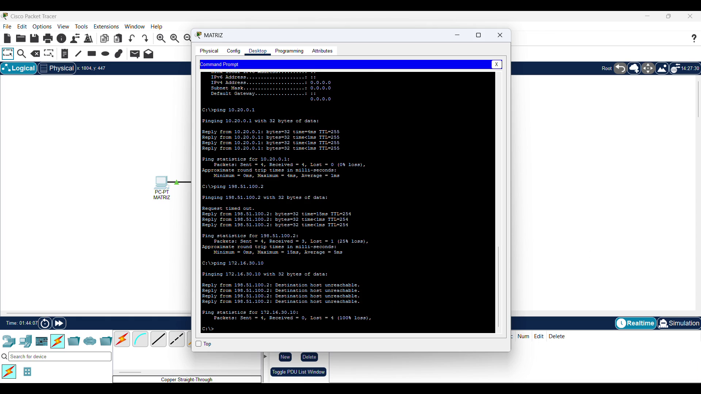
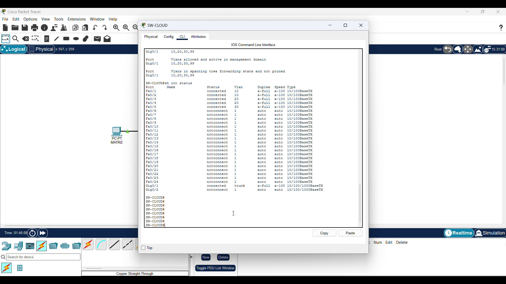

# Lab 02 — Hybrid Cloud Security Architecture

**Author:** [mari-2215](https://github.com/mari-2215)
**Platform:** Cisco Packet Tracer
**Status:** Built, documented, and validated
**Focus:** Segmentation, static NAT, least-privilege ACLs, and bastion-based administration

[Watch or download the edited validation video](video/Lab_02_Hybrid_Cloud_Security_Final.mp4)

[Download the Packet Tracer project](packet-tracer/Lab_02_Hybrid_Cloud_Security.pkt)

## Executive summary

This lab models a headquarters network connected to a segmented cloud environment across a routed WAN. The cloud side separates public web servers, an application tier, a database tier, and a management interface into dedicated VLANs. A static TCP NAT rule publishes WEB1 on port 80, while extended ACLs demonstrate inbound filtering and database protection. Administrative access to R-CLOUD is performed over SSH from an approved bastion-style host. The recorded WAN ACL contains a documented destination-address typo and a broad final permit, so strict WAN filtering is treated as a correction target rather than a validated claim.

The recorded evidence demonstrates successful access to the published web service, active routed subinterfaces, the expected route table, ACL hit counters, NAT translations, SSH status, allowed headquarters-to-cloud reachability, blocked direct database reachability, and an operational 802.1Q trunk. The final video is silent by design and removes setup time, failed attempts, and idle waits.

## Business scenario

A company maintains a small headquarters network and a cloud-hosted three-tier application. Internet-facing services must be reachable without exposing the application and database networks. The database should accept its service connection only from the application server, and management access should be restricted to approved origins.

## Architecture

### Physical connection map

| Device A | Port A | Device B | Port B | Role |
|---|---|---|---|---|
| MATRIZ | FastEthernet0 | R-MATRIZ | G0/0 | Headquarters LAN |
| R-MATRIZ | G0/1 | R-CLOUD | G0/0 | Routed WAN |
| R-CLOUD | G0/1 | SW-CLOUD | G0/1 | 802.1Q trunk |
| SW-CLOUD | F0/1 | WEB1 | FastEthernet0 | Access VLAN 10 |
| SW-CLOUD | F0/2 | WEB2 | FastEthernet0 | Access VLAN 10 |
| SW-CLOUD | F0/3 | APP01 | FastEthernet0 | Access VLAN 20 |
| SW-CLOUD | F0/4 | BASTION | FastEthernet0 | Access VLAN 20 |
| SW-CLOUD | F0/5 | DB01 | FastEthernet0 | Access VLAN 30 |

## Addressing and trust zones

| Zone | VLAN / network | Gateway | Assets | Security purpose |
|---|---|---|---|---|
| Headquarters | `10.20.0.0/24` | `10.20.0.1` | MATRIZ | Approved remote business origin |
| WAN | `198.51.100.0/30` | N/A | R-MATRIZ `.1`, R-CLOUD `.2` | Routed inter-site link |
| DMZ | VLAN 10 — `172.16.10.0/24` | `172.16.10.1` | WEB1, WEB2 | Public-facing web tier |
| Application | VLAN 20 — `172.16.20.0/24` | `172.16.20.1` | APP01, BASTION | Application and controlled administration |
| Database | VLAN 30 — `172.16.30.0/24` | `172.16.30.1` | DB01 | Restricted data tier |
| Management | VLAN 99 — `172.16.99.0/24` | `172.16.99.1` | Infrastructure management | Dedicated management boundary |

All addresses use documentation-only ranges or private lab space. They are not production endpoints.

## Security controls

| Objective | Control | Recorded evidence |
|---|---|---|
| Publish only the required web service | Static TCP NAT from `198.51.100.2:80` to `172.16.10.11:80` | Web page and `show ip nat translations` |
| Define WAN-to-cloud policy | Inbound `WAN-IN` extended ACL; the corrected target is stored in the reference configuration | Recorded output plus documented correction |
| Protect the database tier | `TO-DB` permits APP01 to DB01 on TCP/1433, then denies other database traffic | ACL definition and deny counter |
| Separate tiers | VLANs 10, 20, 30, and 99 with router subinterfaces | `show ip interface brief`, VLAN and trunk output |
| Restrict administration | SSH-only VTY access filtered by standard ACL 20 | Successful bastion SSH and `show ip ssh` |
| Preserve return paths | Static routes between `10.20.0.0/24` and `172.16.0.0/16` | `show ip route` and successful ping |

## Validation matrix

| ID | Test | Expected result | Recorded result | Evidence |
|---|---|---|---|---|
| VAL-01 | MATRIZ opens `http://198.51.100.2` | WEB1 is published through static NAT | Cisco Packet Tracer web page loads | [Screenshot](evidence/public-web-nat.png) |
| VAL-02 | Inspect R-CLOUD from the bastion SSH session | Required interfaces are up/up | WAN and VLAN subinterfaces are up/up | Video |
| VAL-03 | Inspect routes, ACLs, and translations | Routes and policy state are visible | Static route, database/management ACL counters, and active NAT translations are displayed | [Screenshot](evidence/acl-nat-validation.png) |
| VAL-04 | MATRIZ pings `10.20.0.1` | Headquarters gateway is reachable | 4/4 replies | [Screenshot](evidence/connectivity-policy.png) |
| VAL-05 | MATRIZ pings `198.51.100.2` | Cloud WAN interface is reachable | 3/4 replies; the first packet times out during initial resolution | [Screenshot](evidence/connectivity-policy.png) |
| VAL-06 | MATRIZ pings DB01 at `172.16.30.10` | Direct database access is blocked | Destination unreachable / 100% loss | [Screenshot](evidence/connectivity-policy.png) |
| VAL-07 | Inspect SW-CLOUD trunk and access ports | VLANs 10, 20, 30, and 99 traverse G0/1 | Trunk is active and endpoint ports are in the expected VLANs | [Screenshot](evidence/vlan-trunk-validation.png) |

The failed database ping is a successful negative security test: the policy is intended to prevent direct headquarters-to-database access.

## Evidence

### Published web service through static NAT

### ACL counters and NAT translations

### Positive and negative connectivity tests

### VLAN and trunk validation

### Edited demonstration

[Open `Lab_02_Hybrid_Cloud_Security_Final.mp4`](video/Lab_02_Hybrid_Cloud_Security_Final.mp4)

The 2 minute 22 second portfolio cut contains no audio track. It preserves only the successful or security-relevant validation evidence and is signed as **mari-2215**.

## Reproduction

1. Place two Cisco 2911 routers, one Cisco 2960 switch, one headquarters PC, two web servers, one application server, one bastion PC, and one database server.
2. Cable the devices according to the physical connection map.
3. Configure the headquarters LAN and the `/30` routed WAN.
4. Create VLANs 10, 20, 30, and 99 on SW-CLOUD and assign the access ports.
5. Configure G0/1 as an 802.1Q trunk carrying VLANs 10, 20, 30, and 99.
6. Configure R-CLOUD router-on-a-stick subinterfaces and static routes on both routers.
7. Configure the static TCP NAT rule for WEB1.
8. Apply the WAN and database ACLs in the documented direction.
9. Configure SSH with a lab-only account and restrict VTY access with ACL 20.
10. Configure endpoint addresses, save all device configurations, and execute the validation matrix.

Reference configurations are available in the [`configs`](configs) directory. Credentials are intentionally represented as placeholders in the text files; use lab-only values when reproducing the project.

## Troubleshooting lessons

- A green link proves Layer 1 state, not correct addressing, VLAN membership, routing, or policy.
- A host showing `0.0.0.0` needs a valid static address or working DHCP before higher-layer tests are meaningful.
- The first Packet Tracer ping may time out while ARP resolution occurs; later replies determine whether reachability exists.
- A blocked ping can take several seconds because the client waits for every ICMP timeout.
- ACL direction matters. `TO-DB` is evaluated on traffic leaving the database subinterface, while `WAN-IN` evaluates traffic entering from the WAN.
- Packet Tracer IOS syntax varies by device image. Static port forwarding was configured with an explicit global address rather than the unsupported `interface` keyword form.

## Known limitations

- Packet Tracer approximates networking behavior and does not reproduce full cloud-provider, firewall, logging, identity, or stateful-inspection semantics.
- The bastion and application server share VLAN 20 in this educational topology. A production design would normally separate administrative and workload identities more strongly.
- In the recorded `WAN-IN` ACL, the TCP/80 ACE references `198.21.100.2` instead of the configured WAN address `198.51.100.2`, and the final `permit ip any any` prevents a strict inbound least-privilege claim. The text reference configuration contains the corrected target form, but the `.pkt` artifact preserves the recorded lab state for transparency.
- The first WAN ping lost one packet during address resolution; subsequent packets succeeded.
- The recorded negative test proves the database destination was unreachable from MATRIZ and the ACL deny counter increased. It does not replace centralized firewall logs or packet capture in production.
- TCP/1433 represents an example database service. No real database engine or application transaction is running.

## AWS and Azure mapping

| Packet Tracer concept | AWS conceptual analogue | Azure conceptual analogue |
|---|---|---|
| VLAN-based zone | VPC subnet | Virtual Network subnet |
| R-CLOUD routing | VPC route tables / virtual router | VNet system routes and route tables |
| Static web publication | Public load balancer or public IP with controlled listener | Public Load Balancer, Application Gateway, or public IP with controlled rules |
| `WAN-IN` ACL | Network ACL plus scoped security groups | Network Security Group or Azure Firewall policy |
| `TO-DB` least-privilege rule | Database security group allowing only the application security group | Database subnet NSG allowing only the application tier |
| Bastion-restricted SSH | AWS Systems Manager or EC2 Instance Connect Endpoint; bastion pattern when required | Azure Bastion or controlled management subnet |
| IOS counters and translations | VPC Flow Logs, CloudWatch, and NAT/load-balancer telemetry | Virtual network flow logs, Azure Monitor, and firewall/load-balancer logs |

These are conceptual mappings, not claims of identical behavior. Cloud-native security groups and NSGs are stateful, while IOS ACL behavior and placement differ.

## Primary references

- [Cisco — Configure IP Access Lists](https://www.cisco.com/c/en/us/support/docs/security/ios-firewall/23602-confaccesslists.html)
- [Cisco — Configure Network Address Translation](https://www.cisco.com/c/en/us/support/docs/ip/network-address-translation-nat/13772-12.html)
- [Cisco — Configure SSH on Routers](https://www.cisco.com/c/en/us/support/docs/security-vpn/secure-shell-ssh/4145-ssh.html)
- [Cisco — VLAN Configuration Guide](https://www.cisco.com/c/en/us/td/docs/switches/lan/catalyst2960/software/release/15-2_2_e/configuration/guide/scg2960/swvlan.html)
- [AWS — Security groups for your VPC](https://docs.aws.amazon.com/vpc/latest/userguide/vpc-security-groups.html)
- [AWS — Control subnet traffic with network ACLs](https://docs.aws.amazon.com/vpc/latest/userguide/vpc-network-acls.html)
- [AWS — What is AWS Systems Manager?](https://docs.aws.amazon.com/systems-manager/latest/userguide/what-is-systems-manager.html)
- [Microsoft — Azure network security groups overview](https://learn.microsoft.com/en-us/azure/virtual-network/network-security-groups-overview)
- [Microsoft — What is Azure Bastion?](https://learn.microsoft.com/en-us/azure/bastion/bastion-overview)

## Author

Designed, built, validated, and documented by **[mari-2215](https://github.com/mari-2215)**.
