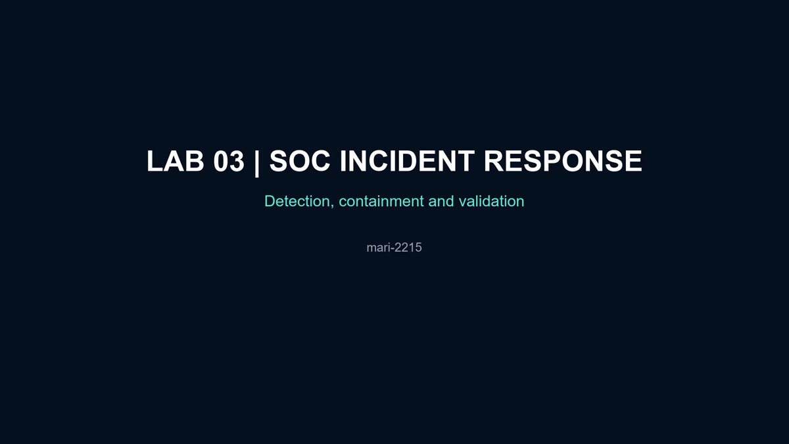

# Lab 03 — SOC Incident Detection and Containment

**Author:** [mari-2215](https://github.com/mari-2215)  
**Status:** Completed

## Objective

Simulate a small SOC incident-response cycle in Cisco Packet Tracer: establish a legitimate HTTP baseline, identify unauthorized traffic through edge ACL counters, contain the source with a specific deny rule, and prove that the legitimate service remains available.

## Topology

- `ATACANTE` — external test host, `203.0.113.66`;
- `CLIENTE` — legitimate external client, `203.0.113.50`;
- `R-EDGE` — edge router and enforcement point;
- `VITIMA` — internal user endpoint in VLAN 10;
- `WEB` and `SYSLOG` — internal servers in VLAN 30;
- `SOC-PC` — management workstation in VLAN 99.

## Defensive controls demonstrated

- VLAN segmentation for users, servers, and management;
- inbound extended ACL on the external router interface;
- HTTP allow rule for the published service;
- deny counters used as detection evidence;
- source-specific containment for `203.0.113.66`;
- restricted management source ACL;
- remote logging configuration;
- configuration persistence with `copy running-config startup-config`.

## Incident-response sequence

1. Confirm that `CLIENTE` can reach `http://10.30.30.10`.
2. Generate unauthorized probes from `ATACANTE`.
3. Review `EDGE-IN` and correlate the rising deny counters.
4. Add `5 deny ip host 203.0.113.66 any` at the top of the ACL.
5. Re-test the attacker and confirm the source-specific rule receives matches.
6. Re-test the legitimate HTTP client to rule out service disruption.
7. Save the configuration and record final interface, ACL, and VLAN evidence.

## Artifacts

- [Packet Tracer topology](packet-tracer/Lab_03_SOC_Incident_Response.pkt)
- [Edited evidence video](video/Lab_03_SOC_Incident_Response_Final.mp4)
- [Evidence screenshots](evidence/)

## Evidence index

| Evidence | What it proves |
| --- | --- |
| `01-topology.png` | External, edge, server, user, and SOC components are connected. |
| `02-legitimate-http-baseline.png` | The legitimate client reaches the WEB service before containment. |
| `03-edge-acl-counters.png` | The edge ACL records permitted HTTP and denied internal probes. |
| `04-source-containment-rule.png` | The identified source is explicitly denied at the edge. |
| `05-attacker-blocked.png` | Unauthorized traffic remains blocked after containment. |
| `06-legitimate-http-preserved.png` | The HTTP service remains available to the legitimate client. |
| `07-router-final-validation.png` | Interfaces are operational, ACL counters increased, and configuration was saved. |
| `08-vlan-segmentation.png` | VLAN 10, 30, and 99 assignments are present on the LAN switch. |

## Cloud-security relevance

The workflow maps directly to cloud defender responsibilities: security-group or NSG enforcement, source-based blocking, log and counter review, blast-radius reduction through segmentation, change validation, and availability checks after containment.

> This is a defensive, isolated lab. The attacker device represents an authorized test source inside the simulation.
