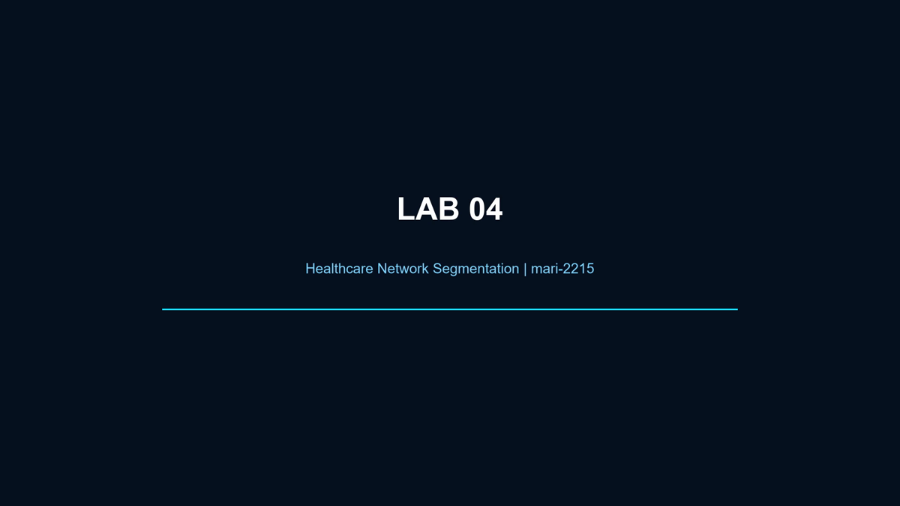

# Lab 04 — Healthcare Network Segmentation

**Author:** [mari-2215](https://github.com/mari-2215)  
**Status:** Completed and recorded

## Direct access

- [Download the Packet Tracer project](packet-tracer/Lab_04_Healthcare_Network_Segmentation.pkt)
- [Watch or download the edited demonstration](video/Lab_04_Healthcare_Network_Segmentation_Final.mp4)

## Objective

Segment a simulated healthcare environment into clinical, IoMT, administrative, server, guest, and IT management zones. Apply least-privilege paths around sensitive services and demonstrate that authorized connectivity can coexist with isolation boundaries.

## Security focus

- role-based VLAN segmentation;
- separate trust zones for clinical, administrative, IoMT, guest, server, and IT traffic;
- controlled inter-VLAN routing;
- ACL-based least privilege;
- restricted infrastructure administration;
- validation of required paths and expected isolation behavior.

## Portfolio relevance

Healthcare environments combine sensitive data, operational continuity requirements, user endpoints, and specialized connected devices. This lab demonstrates the network-design reasoning used to reduce lateral movement and limit unnecessary access to critical services.

## Cloud mapping

The segmentation model maps conceptually to AWS VPC subnets, security groups, and network ACLs, or to Azure VNet subnets, Network Security Groups, and Azure Firewall policy. These are conceptual comparisons rather than claims of identical behavior.

## Evidence boundary

The `.pkt` file preserves the completed simulated topology. The edited video removes setup delays and mistakes while showing the final construction and recorded tests. Packet Tracer is not a compliance assessment and does not reproduce a production EHR, medical device, firewall, or identity platform.

## Author

Built and documented by **[mari-2215](https://github.com/mari-2215)**.
