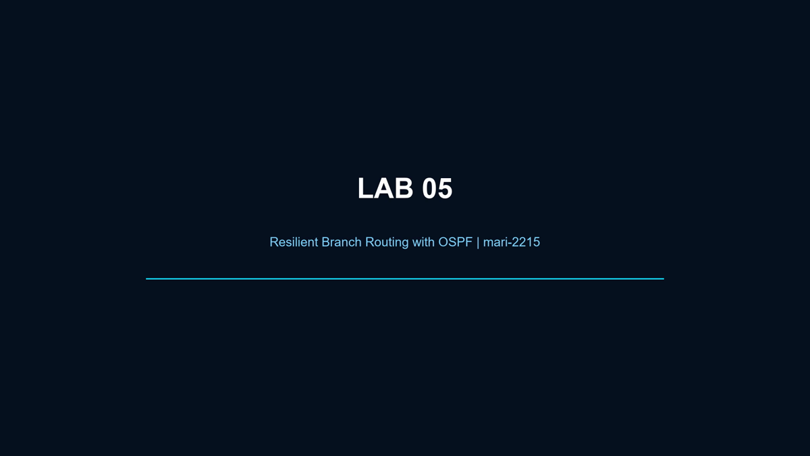

# Lab 05 — Resilient Branch Routing

**Author:** [mari-2215](https://github.com/mari-2215)  
**Status:** Completed and recorded

## Direct access

- [Download the Packet Tracer project](packet-tracer/Lab_05_Resilient_Branch_Routing.pkt)
- [Watch or download the edited demonstration](video/Lab_05_Resilient_Branch_Routing_Final.mp4)

## Objective

Connect a headquarters network and multiple branches with OSPF, establish route exchange, observe the operational topology, fail a link, and reason about convergence through an alternate path.

## Topology roles

- `R-MATRIZ` — headquarters router and access to the central service network;
- `R-F1`, `R-F2`, and `R-F3` — branch routers participating in OSPF;
- routed point-to-point links — primary and alternate paths between sites;
- central server — reachability target advertised from headquarters.

## Skills demonstrated

- IPv4 addressing on routed links and LAN interfaces;
- OSPF process and network advertisement configuration;
- neighbor verification with `show ip ospf neighbor`;
- route verification with `show ip route`;
- path inspection with `traceroute`;
- link-failure simulation and convergence reasoning;
- structured troubleshooting when a subnet is missing from the routing table.

## Portfolio relevance

Resilient routing is a foundation for secure operations: monitoring, incident response, remote administration, and cloud connectivity all depend on predictable reachability and recoverable paths. The lab demonstrates how adjacency and route evidence are used instead of assuming that a green link guarantees end-to-end service.

## Cloud mapping

The design maps conceptually to redundant site-to-site VPN paths, transit routing, dynamic route exchange, health monitoring, and failover in AWS or Azure. Packet Tracer OSPF is an educational approximation and is not a direct implementation of cloud route services.

## Evidence boundary

The `.pkt` file contains the completed simulated network and the edited video records the usable evidence from the build. Failed or incomplete traceroutes are treated as troubleshooting evidence rather than proof of successful convergence.

## Author

Built and documented by **[mari-2215](https://github.com/mari-2215)**.
